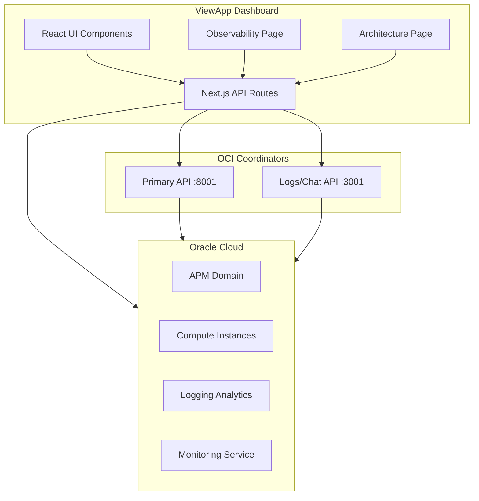

# ViewApp - OCI Coordinator Dashboard

> **DISCLAIMER:** This is a personal "vibe code" project created to showcase the capabilities of OCI APM (Application Performance Monitoring), GenAI Agents working with OCI Infrastructure and services, and advanced visibility using OCI tools. **This is NOT an Oracle endorsed project.** Use at your own risk and discretion.

A modern Next.js dashboard for monitoring and visualizing your OCI (Oracle Cloud Infrastructure) Coordinator services, AI agents, and MCP (Model Context Protocol) servers.


## Features

- **Real-time Dashboard** - Monitor coordinator status, agent health, and system metrics
- **Observability** - Distributed traces, APM metrics, and performance insights with instance filtering
- **Architecture Visualization** - Interactive graph showing agents, MCP servers, and their connections
- **Log Streaming** - Live log feed with filtering and search capabilities
- **APM Integration** - OCI Application Performance Monitoring metrics and traces
- **Compute Instance Monitoring** - View and filter by OCI compute instances
- **Troubleshooting** - Integrated troubleshooting tools and diagnostics
- **Floating Chat** - Ask questions about your infrastructure from any page
- **Graceful Degradation** - Works offline with status indicators when services are unavailable
- **Dark Theme** - Modern, cyber-industrial interface

## What This Project Showcases

- **OCI APM Integration** - Real distributed tracing and APM metrics from Oracle Cloud
- **OCI Compute SDK** - Live instance monitoring and management
- **GenAI Agents** - AI-powered agents working with OCI infrastructure
- **MCP Protocol** - Model Context Protocol server integration
- **Advanced Visibility** - Comprehensive observability across cloud resources

## Architecture

```
                                    ┌─────────────────────────────────────┐
                                    │         ViewApp Dashboard           │
                                    │         (localhost:4001)            │
                                    │                                     │
                                    │  Pages:                             │
                                    │  • Dashboard (/)                    │
                                    │  • Observability (/observability)   │
                                    │  • Architecture (/architecture)     │
                                    │  • Logs (/feed)                     │
                                    │  • OCI (/oci)                       │
                                    │  • Settings (/settings)             │
                                    │  • Troubleshoot (/troubleshoot)     │
                                    └──────────────┬──────────────────────┘
                                                   │
                    ┌──────────────────────────────┼──────────────────────────────┐
                    │                              │                              │
                    ▼                              ▼                              ▼
    ┌───────────────────────────┐  ┌───────────────────────────┐  ┌───────────────────────────┐
    │   Primary Coordinator     │  │   Logs/Chat Coordinator   │  │      OCI APIs Direct      │
    │    (localhost:8001)       │  │    (localhost:3001)       │  │    (SDK Authenticated)    │
    │                           │  │                           │  │                           │
    │  • System Status          │  │  • Log Streaming          │  │  • APM Traces & Metrics   │
    │  • Agent Registry         │  │  • Chat Interface         │  │  • Compute Instances      │
    │  • MCP Tools              │  │  • APM Proxy              │  │  • Logging Analytics      │
    │  • Architecture Data      │  │  • Coordinator Logs       │  │  • Monitoring Service     │
    │  • Slack Integration      │  │                           │  │                           │
    └───────────────────────────┘  └───────────────────────────┘  └───────────────────────────┘
                    │                              │                              │
                    └──────────────────────────────┼──────────────────────────────┘
                                                   │
                                    ┌──────────────┴──────────────┐
                                    │     Oracle Cloud (OCI)      │
                                    │  • APM Domain               │
                                    │  • Logging Analytics        │
                                    │  • Monitoring               │
                                    │  • Compute                  │
                                    │  • GenAI Agents             │
                                    └─────────────────────────────┘
```

### Component Architecture

```
src/
├── app/                          # Next.js App Router
│   ├── api/                      # Server-side API Routes
│   │   ├── agents/               # Agent registry
│   │   ├── apm/                  # APM metrics & traces proxy
│   │   │   ├── metrics/          # APM metrics endpoint
│   │   │   └── traces/           # Distributed traces endpoint
│   │   ├── architecture/         # Architecture graph data
│   │   ├── chat/                 # Chat endpoint
│   │   ├── compute/              # Compute instances
│   │   ├── coordinator/          # Coordinator status/logs
│   │   ├── health/               # Health check
│   │   ├── logs/                 # Log streaming
│   │   ├── oci/                  # Direct OCI SDK calls
│   │   ├── slack/                # Slack integration
│   │   ├── status/               # System status
│   │   └── tools/                # MCP tools list
│   ├── architecture/             # Architecture visualization page
│   ├── feed/                     # Log feed page
│   ├── observability/            # Observability page (APM + Traces)
│   ├── oci/                      # OCI dashboard page
│   ├── settings/                 # Settings & configuration
│   └── troubleshoot/             # Troubleshooting tools
├── components/
│   ├── charts/                   # Chart components
│   ├── chat/                     # Chat components
│   ├── common/                   # Reusable components
│   ├── dashboard/                # Dashboard widgets
│   ├── layout/                   # App layout (Sidebar, Header)
│   ├── observability/            # APM, Traces, Instance Selector
│   ├── tools/                    # Tool components
│   └── troubleshoot/             # Troubleshooting components
├── hooks/                        # Custom React hooks
├── lib/                          # Utilities (OCI auth)
└── services/                     # Service layer
```

### Data Flow



## Prerequisites

- **Node.js** 18.x or higher
- **npm** or **yarn**
- **OCI Coordinator** running (optional - app works without it)
- **OCI Account** with configured credentials (optional - for direct OCI API calls)

## Quick Start

```bash
# Clone the repository
git clone https://github.com/adibirzu/viewapp.git
cd viewapp

# Install dependencies
npm install

# Copy environment template
cp .env.example .env.local

# Run development server
npm run dev:clean
```

Open [http://localhost:4001](http://localhost:4001) in your browser.

## Configuration

### Environment Variables

Copy `.env.example` to `.env.local` and configure as needed:

```bash
# Backend Coordinator URLs
COORDINATOR_URL=http://127.0.0.1:8001      # Primary API
COORDINATOR_API_URL=http://127.0.0.1:3001  # Logs/Chat API

# OCI Configuration (for direct API calls)
OCI_COMPARTMENT_ID=ocid1.compartment.oc1..your-compartment
OCI_TENANCY_ID=ocid1.tenancy.oc1..your-tenancy
OCI_REGION=eu-frankfurt-1

# OCI APM (for observability features)
OCI_APM_DOMAIN_ID=ocid1.apmdomain.oc1..your-domain
OCI_APM_REGION=eu-frankfurt-1
OCI_APM_ENDPOINT=https://your-apm.apm-agt.region.oci.oraclecloud.com

# OCI Logging (optional)
OCI_LOG_GROUP_ID=ocid1.loggroup.oc1..your-log-group
OCI_LOG_ID=ocid1.log.oc1..your-log
```

See `.env.example` for all available options with detailed comments.

### OCI SDK Authentication

For direct OCI API calls, configure your `~/.oci/config` file:

```ini
[DEFAULT]
user=ocid1.user.oc1..your-user
fingerprint=your:fingerprint:here
tenancy=ocid1.tenancy.oc1..your-tenancy
region=us-ashburn-1
key_file=~/.oci/your-api-key.pem
```

## Pages Overview

| Page | Path | Description |
|------|------|-------------|
| Dashboard | `/` | System overview with quick stats and status |
| Observability | `/observability` | Distributed traces, APM metrics with instance filtering |
| Architecture | `/architecture` | Interactive visualization of coordinator |
| Logs | `/feed` | Real-time log streaming |
| OCI | `/oci` | Direct OCI metrics and monitoring |
| Settings | `/settings` | Configuration and connection status |
| Troubleshoot | `/troubleshoot` | Diagnostics and troubleshooting tools |

## Development

```bash
# Development server with auto port-kill
npm run dev:clean

# Standard development server
npm run dev

# Build for production
npm run build

# Production server
npm run start:clean

# Manually kill port 4001
npm run kill-port
```

## Tech Stack

| Technology | Purpose |
|------------|---------|
| [Next.js 15](https://nextjs.org/) | React framework with App Router |
| [React 19](https://react.dev/) | UI library |
| [ReactFlow](https://reactflow.dev/) | Interactive graph visualization |
| [Dagre](https://github.com/dagrejs/dagre) | Graph layout algorithm |
| [OCI SDK](https://docs.oracle.com/en-us/iaas/tools/typescript/latest/) | Oracle Cloud API access |
| CSS Modules | Scoped component styling |

## Graceful Degradation

ViewApp is designed to work even when backend services are unavailable:

- All API routes return HTTP 200 with fallback data
- Components display "offline" or "unavailable" status
- No crashes when coordinator is not running
- Connection status indicators in the UI

## Related Projects

- [OCI Coordinator](https://github.com/adibirzu/oci-coordinator) - The AI coordinator that this dashboard monitors
- [OCI MCP Server](https://github.com/adibirzu/oci-mcp-server) - MCP server for OCI operations

## Contributing

1. Fork the repository
2. Create your feature branch (`git checkout -b feature/amazing-feature`)
3. Commit your changes (`git commit -m 'Add amazing feature'`)
4. Push to the branch (`git push origin feature/amazing-feature`)
5. Open a Pull Request

## License

This project is licensed under the MIT License - see the [LICENSE](LICENSE) file for details.

## Disclaimer

This is a personal project for educational and demonstration purposes. It is not affiliated with, endorsed by, or supported by Oracle Corporation. Use of Oracle Cloud Infrastructure services is subject to Oracle's terms of service and pricing.

---

Built with passion for cloud observability and AI agents
